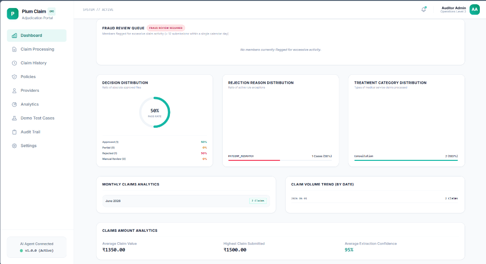
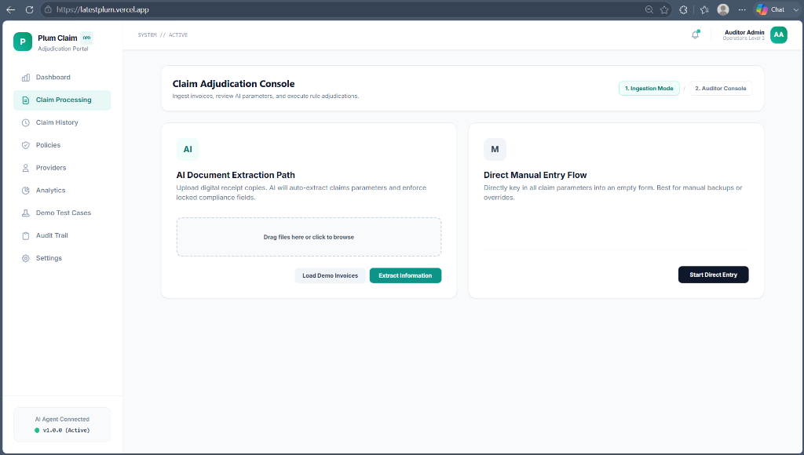
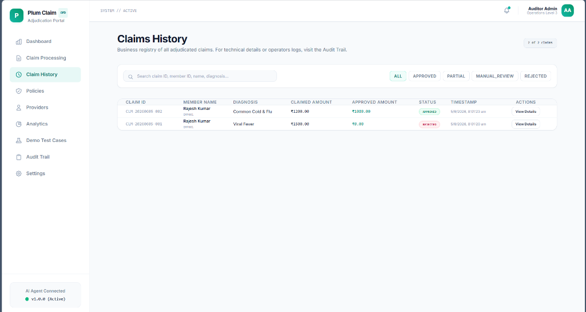
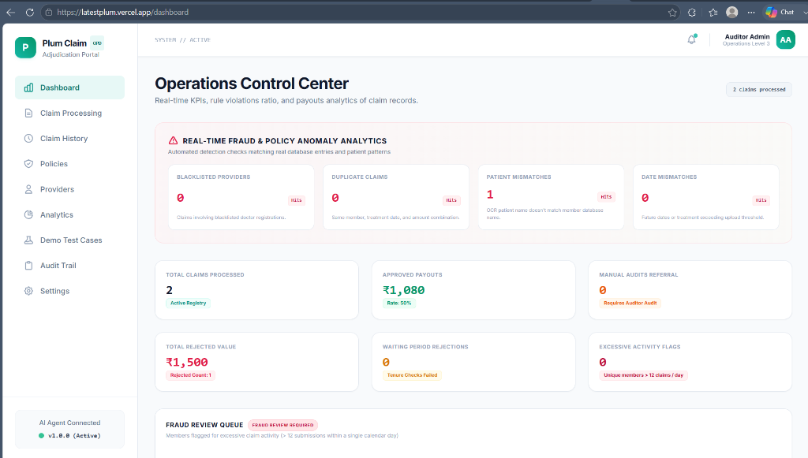
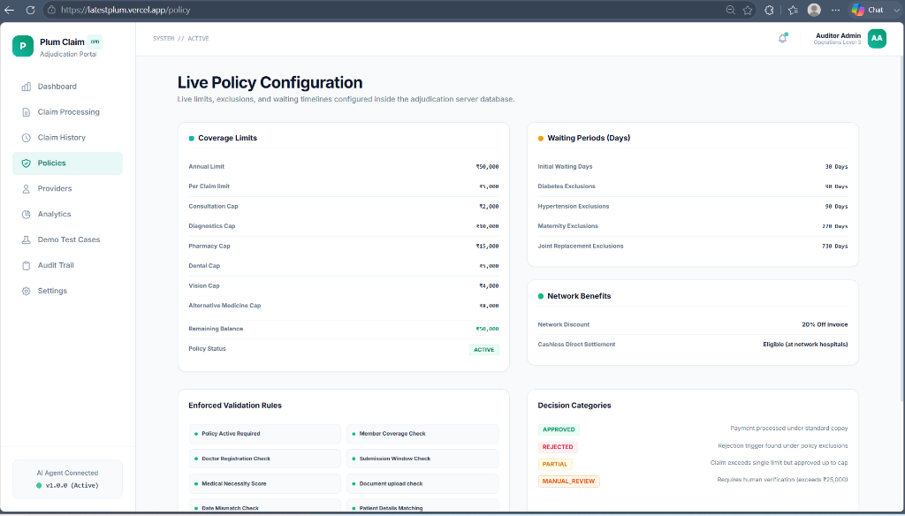
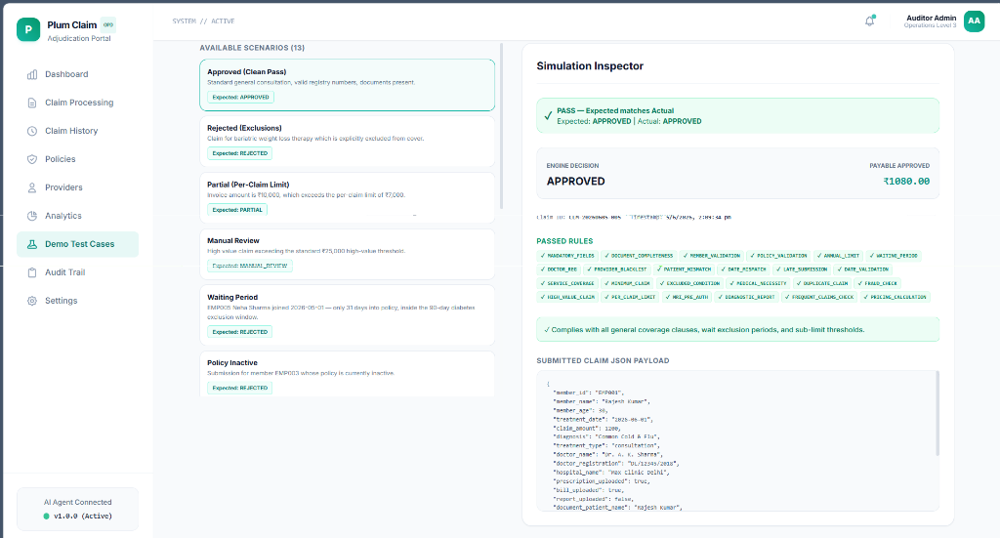
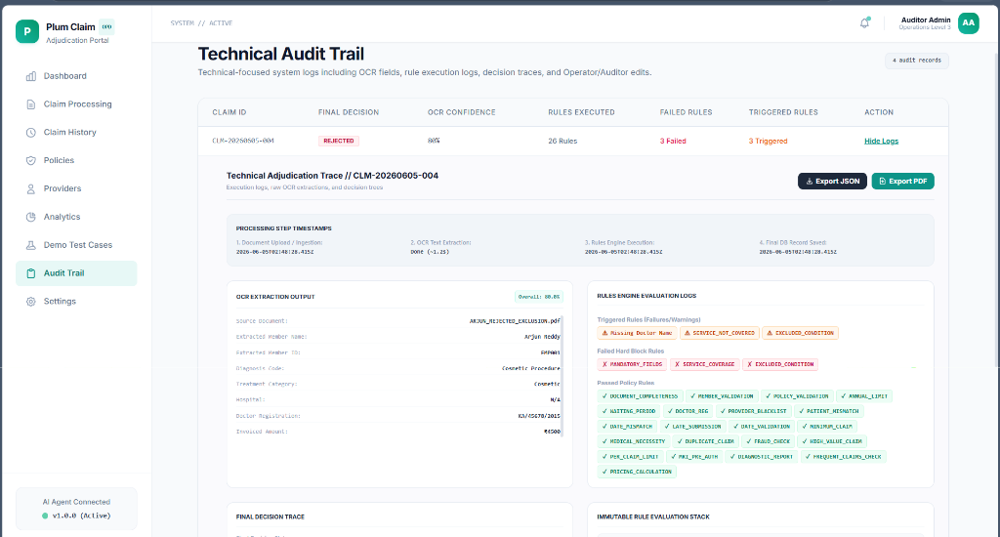
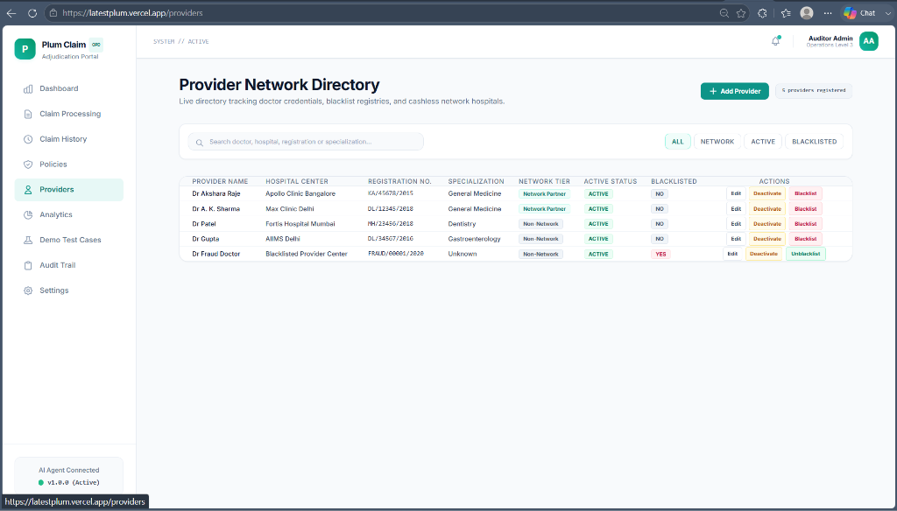
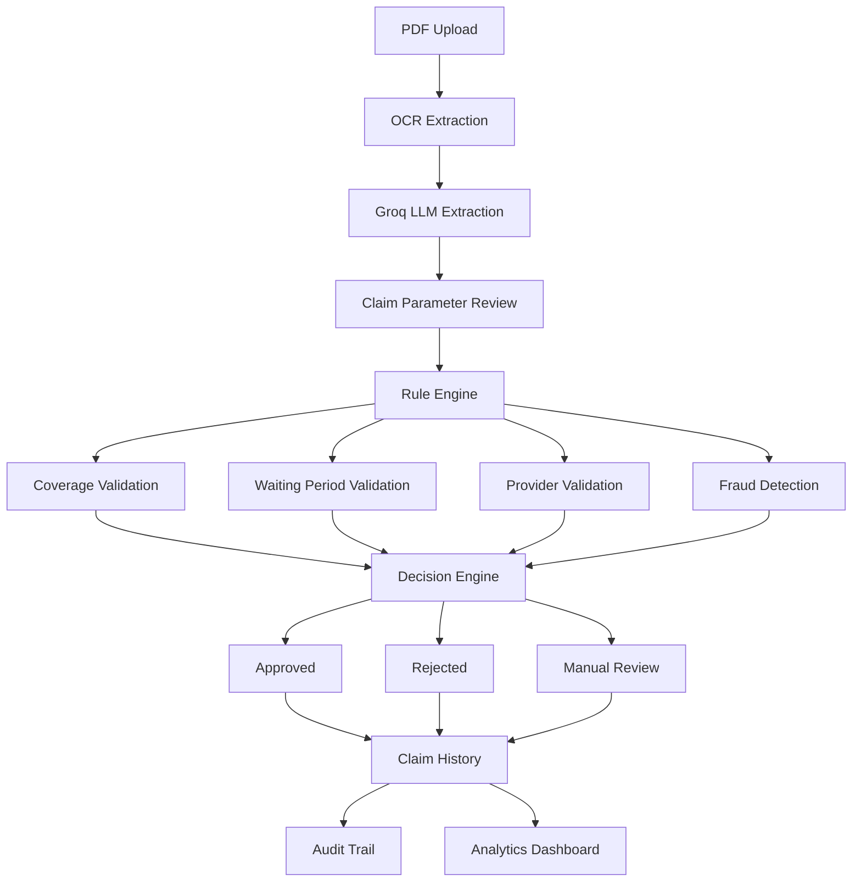

# Plum Health Claims Adjudication Platform

AI-powered OPD Health Insurance Claim Adjudication System built using FastAPI, MongoDB, Groq LLM, OCR, and Next.js.

---

## Live Demo

### Frontend
https://latestplum.vercel.app

### Backend API
https://plum-health-claims.onrender.com

### GitHub Repository
https://github.com/Saiteja1730/plum-health-claims

---

# Project Overview

The Plum Health Claims Adjudication Platform automates OPD insurance claim processing using OCR, Large Language Models, policy-rule evaluation, fraud detection, and explainable audit trails.

The system accepts medical claim documents, extracts structured information using AI, validates policy coverage, applies adjudication rules, detects fraud signals, and generates approval/rejection decisions with full auditability.

---

# Screenshots

### 1. Dashboard / Analytics


### 2. Claim Adjudication Console


### 3. Claims History


### 4. Operations Control Center (Fraud Analytics)


### 5. Policy Configuration


### 6. Demo Test Cases & Sandbox


### 7. Technical Audit Trail


### 8. Provider Network Directory


---

# Key Features

## AI Document Processing

- PDF document upload
- OCR text extraction
- LLM-powered medical field extraction
- Automatic claim parameter population
- Confidence scoring for extracted fields

Extracted fields include:

- Member ID
- Member Name
- Age
- Diagnosis
- Treatment Type
- Claim Amount
- Doctor Name
- Doctor Registration Number
- Hospital Name
- Treatment Date
- Prescription Date
- Bill Date

---

## Automated Claim Adjudication

The platform automatically evaluates:

### Coverage Rules

- Policy Active Check
- Member Coverage Check
- Annual Limit Validation
- Per Claim Limit Validation
- Treatment Coverage Validation

### Waiting Period Validation

The system validates:

- Member Join Date
- Policy Join Date
- Treatment Date

Examples:

- Initial Waiting Period (30 Days)
- Diabetes Waiting Period (90 Days)
- Hypertension Waiting Period (90 Days)
- Maternity Waiting Period (270 Days)

---

## Fraud Detection Engine

The platform identifies:

### Duplicate Claims

Detection based on:

- Member ID
- Treatment Date
- Claim Amount
- Document Hash

### Blacklisted Providers

Checks doctor registration against provider registry.

### Patient Mismatches

Compares OCR patient details with registered member data.

### Date Validation

Detects:

- Future treatment dates
- Invalid submission dates
- Suspicious timelines

### Excessive Activity Detection

Flags members exceeding daily claim thresholds.

---

## Provider Network Management

Provider directory management includes:

- Add Provider
- Edit Provider
- Activate Provider
- Deactivate Provider
- Blacklist Provider
- Unblacklist Provider

Provider validations:

- Doctor Registration Verification
- Network Provider Validation
- Blacklist Detection

---

## Explainable AI Decision Engine

Every decision contains:

### Approved Claims

- Approval reason
- Payable amount
- Co-pay calculation
- Network discounts

### Rejected Claims

- Exact rejection reason
- Failed policy rules
- Missing documents
- Coverage violations

### Manual Review

Claims are routed for auditor review when:

- Mandatory information is missing
- OCR confidence is low
- Provider information cannot be validated
- Policy ambiguity exists

---

## Audit Trail System

Every adjudication generates a complete technical audit record.

Stored information includes:

### OCR Audit

- Raw extracted values
- Confidence scores
- Source document

### Rule Execution Logs

- Rules Executed
- Rules Passed
- Rules Failed
- Triggered Policy Conditions

### Decision Trace

- Approval Path
- Rejection Path
- Manual Review Path

### Export Support

- JSON Export
- PDF Export

---

# System Architecture



---

## 🧪 Testing & The Sandbox

To make evaluating the platform simple, the application includes a **Sandbox Mode**. 

### The "Reset Sandbox" Feature
Because the system employs strict fraud rules (such as rejecting claims if a provider is blacklisted or if a user submits more than 10 claims in one day), testing the same scenarios repeatedly will eventually trigger fraud flags. 

To solve this, the **Demo Test Cases** page includes a **"Reset Sandbox"** button. Clicking this button will:
1. Wipe all processed claims history.
2. Unblacklist all demo doctors.
3. Reseed the active policies and members to their default clean states.

*If test cases start unexpectedly failing due to "Excessive Claim Activity" or "Provider Blacklisted," simply click Reset Sandbox to restore a clean environment.*

---

## Setup Instructions

### 1. Clone the repository
```bash
git clone https://github.com/Saiteja1730/plum-health-claims.git
cd plum-health-claims
```

### 2. Backend Setup
```bash
cd backend
python -m venv .venv
.venv\Scripts\activate
pip install -r requirements.txt

# Set your environment variables in .env (GROQ_API_KEY, MONGO_URI)
python -m uvicorn main:app --reload
```

### 3. Frontend Setup
```bash
cd frontend
npm install
npm run dev
```
