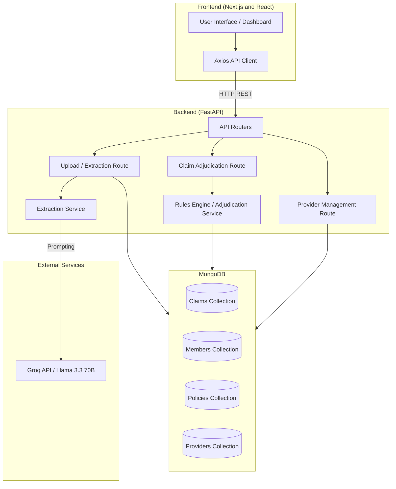
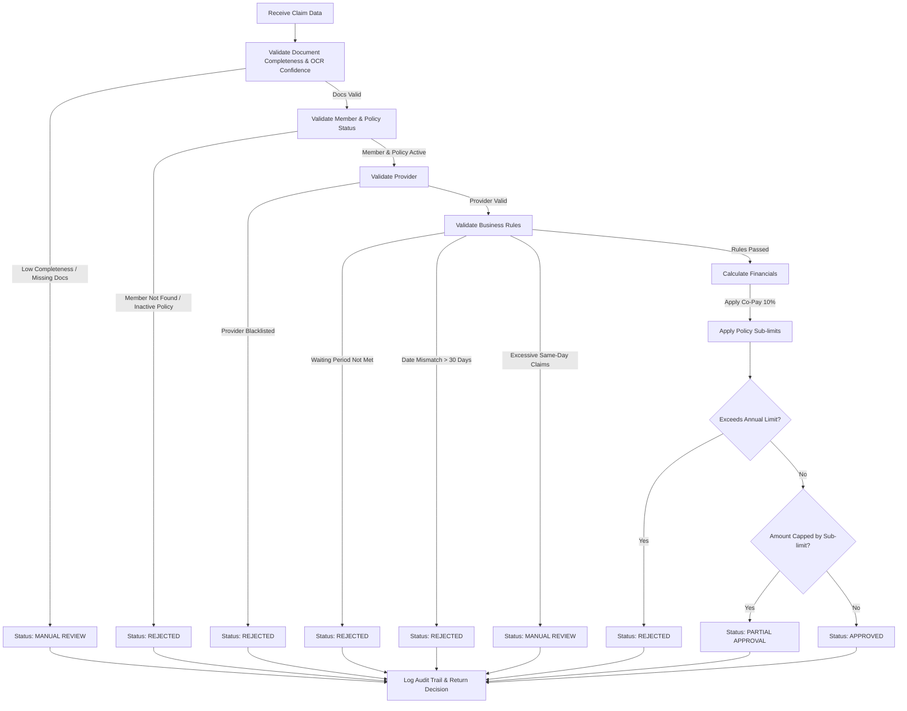

# Plum Health Claims Adjudication System

This document outlines the architecture, APIs, decision logic, and assumptions for the Plum Health Claims Adjudication AI System.

---

## 1. Architecture Diagram

The system follows a modern decoupled Client-Server architecture utilizing a React-based Frontend and a FastAPI Backend powered by an LLM extraction engine and MongoDB.



---

## 2. API Documentation

The backend is built with FastAPI and runs on port `8000`.

### Document Processing
- **`POST /documents/upload`**
  - **Purpose**: Accepts a PDF medical document, runs OCR, and utilizes the Groq LLM to extract structured JSON data. It also cross-references the extracted data with the database to enrich it with provider and policy metadata.
  - **Payload**: `multipart/form-data` containing `file`.
  - **Response**: Extracted JSON data, normalized fields, and intelligent document presence flags.

### Claim Adjudication
- **`POST /claims/process`**
  - **Purpose**: Submits a structured claim payload to the Adjudication Rules Engine to determine the decision (`APPROVED`, `PARTIAL`, `MANUAL_REVIEW`, `REJECTED`).
  - **Payload**: JSON matching the `Claim` Pydantic model.
  - **Response**: Comprehensive decision trace including passed/failed rules, audit logs, calculated financials, and status.

- **`POST /claims/reset-sandbox`**
  - **Purpose**: Clears the database and reseeds it with default test data for members, policies, and providers to allow repeatable sandbox testing.

- **`GET /claims/{claim_id}/export/pdf`**
  - **Purpose**: Generates and downloads a text-based Audit Report for a processed claim.

### Provider Management
- **`GET /providers`**: Returns a list of all registered medical providers.
- **`POST /providers/add`**: Adds a new medical provider to the database.
- **`PUT /providers/edit`**: Modifies an existing provider's details.
- **`PUT /providers/blacklist`**: Toggles the blacklist status of a provider.
- **`PUT /providers/deactivate`**: Toggles the active status of a provider.

---

## 3. Decision Logic Flowchart

The Adjudication Service (`AdjudicationService.adjudicate_claim`) processes claims through a strict, multi-stage priority rules engine.



---

## 4. List of Assumptions Made

During the development of this system, the following assumptions were made regarding business logic, edge cases, and environment:

1. **Document Bundling:**
   - **Assumption:** A single uploaded PDF might contain the invoice, prescription, and medical reports combined. 
   - **Handling:** We implemented "Smart Document Detection." If the LLM extracts valid diagnosis/doctor info, we assume the prescription is present. If an amount is extracted, we assume the bill is present.

2. **OCR / Extraction Fallbacks:**
   - **Assumption:** LLMs may occasionally fail to extract specific sub-dates (like `prescription_date` or `bill_date`) even if they extract the overarching `treatment_date`.
   - **Handling:** Missing dates intelligently fall back to the `treatment_date` to prevent false "Missing Date" rejections.

3. **Provider Network Defaults:**
   - **Assumption:** If a provider does not explicitly exist in our `providers_collection`, they are considered an "Out of Network" provider rather than an automatic fraud rejection, allowing the claim to proceed but without cashless benefits.

4. **Timezones:**
   - **Assumption:** All claims and audits are tracked in UTC to ensure consistency, though the frontend may format them to local Indian Standard Time (`en-IN`) for the auditor.

5. **LLM Execution:**
   - **Assumption:** The Groq API is highly performant but may occasionally return text wrapped in markdown blocks (e.g., ` ```json `).
   - **Handling:** The backend explicitly sanitizes the LLM string output to strip markdown before parsing it into a Python dictionary.

6. **Fraud Limits:**
   - **Assumption:** A high frequency of claims from the same user on the same day is indicative of fraud or a system loop.
   - **Handling:** The rules engine tracks `previous_claims_same_day` via the database, flagging the claim for `MANUAL_REVIEW` if a user exceeds 10 claims in a single day.
